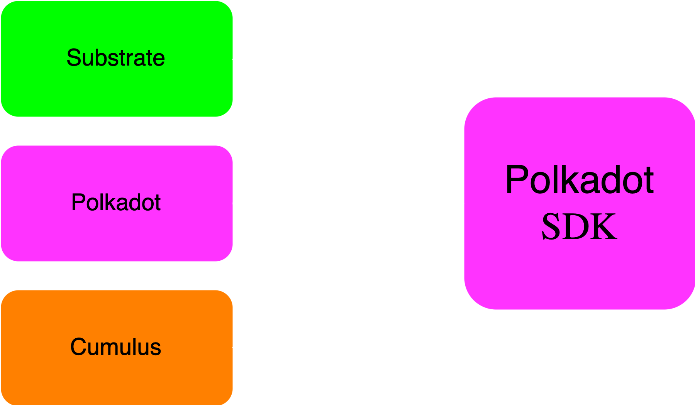

# Contributing to the Polkadot SDK

---

<!-- check size -->

---

## Prerequisite Knowledge

- Mid-Level Rust Programming Abilities
  - Fluency with the first 11 chapters of The Rust Book
- Mid-Level Understanding of Blockchains
  - Basics of Cryptography, Game Theory, Economics
  - Fundamentals of Bitcoin and Ethereum
  - Smart Contracts / State Machines
- Basic Understanding of Polkadot

---

## Learn Rust for Substrate

<pba-flex center>
https://dotcodeschool.com/
</pba-flex>

---

## The Polkadot Blockchain Academy

<!-- need to fix this, not sure how to have multiple images in the collage. Table can be on the right side -->

<pba-col right>
5 Global Cohorts
5 Weeks in Person
7 Modules
~1,000 Applicants*
~90 Students*
~50 Graduates*
~20 Hires*
</pba-col>

https://polkadot.network/academy/

---

# I just graduated from the Polkadot Blockchain Academy…

#### _... now what?_

---

### Polkadot SDK
<!-- original slides had 90 and -90 degree "Polkadot SDK text around a box-->

---

## The Mono Repo
<!-- skipped Polkadot SDK repo has evolved slide, not relevant for PBA-->

<pba-col right>
- Merging into a single repository simplifies the development process
- Eliminates the need for “companion” PRs across multiple repositories.
- Improves collaboration among team members. 
- Makes it easier to manage issues, pull requests, and documentation.
</pba-col>

---

## Runtime Extraction

<pba-col right>
Extraction of the various Polkadot Runtimes established the decentralized ownership of this code. Includes:
- Relay Chain Runtimes
  - Polkadot
  - Kusama
- System Parachains
  - Asset Hub
  - Bridges Hub
  - Collectives
  - etc...
</pba-col>

---

## Repository Ownership

<pba-col left>
Parity Technologies
</pba-col>

The Polkadot Network via the Fellowship
</pba-col>

---

## Polkadot RFCs
- Requests for Comment (RFCs) are proposed changes to the technical implementation of the Polkadot network.
- The Polkadot Fellowship reviews and provides feedback to the RFCs.
- RFC approval is done on-chain either by the fellowship or through public referendum.
- The Polkadot Fellowship also stewards forward approved RFCs.

https://github.com/polkadot-fellows/RFCs

---

### Fellowship
<!-- original slides had 90 and -90 degree "Fellowship" text around a box-->

---

## The Fellowship

- A technical organization that stewards the development of the Polkadot Network.
- Composed of core developers and researchers.
- Servants to the DOT holders via referendum signaling.

https://github.com/polkadot-fellows

---

https://github.com/polkadot-fellows/manifesto

---

The current Polkadot Fellows.

---

## Rank Summary

<table class="no-bullet-padding">
<tr>
  <td>Dan</td>
  <td>Title</td>
  <td>Time from Dan I</td>
  <td>Salary Factor (OECD)</td>
</tr>
<tr class="text-small">
<td>

- n/a
- I
- II
- III
- IV
- V
- VI
- VII
- VIII
- IX
</td>
<td>
- Candidate
- Humble
- Proficient
- Fellow
- Architect
- Architect Adept
- Grant Architect
- Free Master
- Master Constant
- Grand Master
</td>
<td>
- n/a
- n/a
- ~1 year
- ~2 years
- 3 years
- > 4 years
- > 5 years
- > 6 years!
- > 11 years!
- > 19 years!
</td>
<td>
- 0.0
- 0.125
- 0.25
- 1.0
- 1.5
- 2.0
- 2.5
- 2.5
- 2.5
- 2.5
</td>

Salary RFC: https://github.com/polkadot-fellows/RFCs/pull/50/
OECD: Organisation for Economic Co-operation and Development

<pba-col right>
- The fellowship has different ranks based on their contributions to Polkadot.
- The requirements to be promoted are defined in the manifesto.
- Fellowship members can choose to accept a salary for their rank.
- Salary is based on the OECD average salary for engineers.
</pba-col>

---

## Dan I

The requirements (condensed) to become a Dan I member of the Polkadot Fellowship are:

<pba-col left>
Three clear examples of a modest but substantial contribution to protocol development.
Actively been involved in the design of a component deployed to the network.
Substantially assisted in the analysis, or authoring of formalisation or implementation of a protocol component.
Should be able to list all key goals, principles and tenets of Polkadot’s overall philosophy.
</pba-col>
<pba-col right>
</pba-col>

## Overview
<pba-flex center>
- Synchronous vs asynchronous
- Why is asynchronous backing desirable?
<!-- .element: class="fragment" data-fragment-index="1" -->
- High level mechanisms of async backing
<!-- .element: class="fragment" data-fragment-index="2" -->
- The unincluded segment, and prospective parachains
<!-- .element: class="fragment" data-fragment-index="3" -->
- Async backing enabling other roadmap items
<!-- .element: class="fragment" data-fragment-index="4" -->
</pba-flex>
---
## Synchronous Backing Simplified

> How is this synchronous?
<!-- .element: class="fragment" data-fragment-index="1" -->
Notes:
- The dividing line between the left and right is when a candidate is backed on chain
- Approvals, disputes, and finality don't immediately gate the production of farther candidates.
  So we don't need to represent those steps in this model.
---
## Async Backing Simplified

<!-- .element: class="fragment" data-fragment-index="1" -->

<!-- .element: class="fragment" data-fragment-index="2" -->

> How is this asynchronous?
<!-- .element: class="fragment" data-fragment-index="3" -->
Notes:
- Our cache of parablock candidates allows us to pause just before that dividing line, on-chain backing
- Why is backing asynchronous in this diagram?
---
## The Async Backing Optimistic Collator Assumptions
<pba-flex center>
1. "The best existing parablock I'm aware of will eventually be included in the relay chain."
1. "There won't be a chain reversion impacting that best parablock."
<!-- .element: class="fragment" data-fragment-index="1" -->
</pba-flex>
 
 
> The Stakes Are Low
<!-- .element: class="fragment" data-fragment-index="2" -->
Notes:
Best is determined by a process similar to the BABE fork choice rule.
Brief BABE fork choice rule review
---
